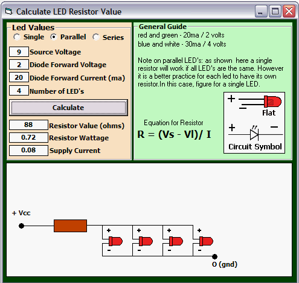



## LED Resistor Calculator

### Description

It seems LED's are everywhere. So here is a calculator to figure the resistor value for you. As usual, I've taken a simple formula and made it really complicated. Hope you find it helpful.
 
### More Info
 

             |
---                |---
**Submitted On**   |2010-05-18 15:11:12
**By**             |[Kenneth Foster](https://github.com/Planet-Source-Code/PSCIndex/blob/master/ByAuthor/kenneth-foster.md)
**Level**          |Intermediate
**User Rating**    |4.8 (24 globes from 5 users)
**Compatibility**  |VB 6\.0
**Category**       |[Miscellaneous](https://github.com/Planet-Source-Code/PSCIndex/blob/master/ByCategory/miscellaneous__1-1.md)
**World**          |[Visual Basic](https://github.com/Planet-Source-Code/PSCIndex/blob/master/ByWorld/visual-basic.md)
**Archive File**   |[LED\_Resist2181325182010\.zip](https://github.com/Planet-Source-Code/kenneth-foster-led-resistor-calculator__1-73163/archive/master.zip)

